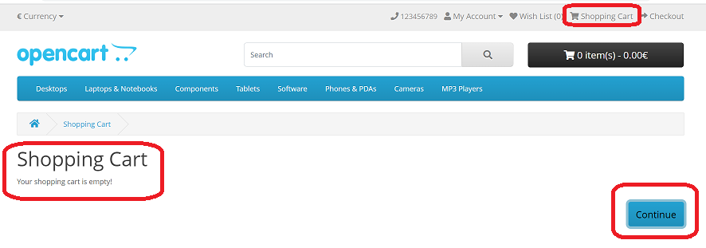

# Teacher's TAQC. PAGE-OBJECT APPROACH

## [branch version-first](https://github.com/ViraHarasymiv/page-object-approach/tree/version-first) - solution with BaseObject

## [branch version-second](https://github.com/ViraHarasymiv/page-object-approach/tree/version-second) - solution based on [ti006 project](https://github.com/softservedata/ti006/tree/pageobj)

=========================================================================

## Description

Write a PageObject class of ShoppingCartEmptyPage that corresponds to an empty Shopping Cart page.
The class must inherit from the TopPart.java base class.
Add three fields (webelements) to the class:
- Label: Shopping Cart
- Label: Your shopping cart is empty!
- Button: Continue.

  Implement the constructor, methods for obtaining the text of the fields, click on the Continue button.
  When you click on Continue, go to HomePage.
  Prepare the following test script:
1. go to https://demo.opencart.com/ get HomePage
2. in the main menu of the HomePage, click on Shopping Cart
3. Check that the page is empty (check the content of the label: "Your shopping cart is empty!")
4. click on the Continue button
5. Make sure the HomePage is loaded.

## Libraries
- [WebDriver Manager](https://bonigarcia.dev/webdrivermanager/)
- [Selenium-java](https://mvnrepository.com/artifact/org.seleniumhq.selenium/selenium-java)
- [TestNG](https://mvnrepository.com/artifact/org.testng/testng)

